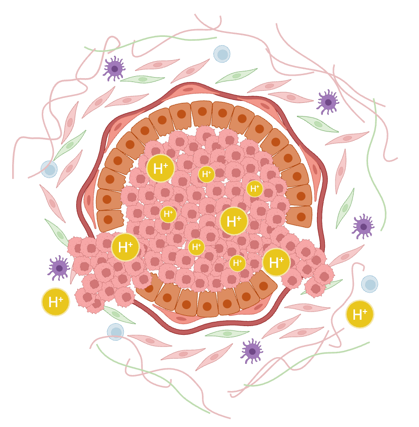

<figure class="figure">
  
</figure>

### Project 3: Co-evolution of Tumor and Stroma in Breast Cancer
- **Aim 1:** Investigate the role of cancer-associated fibroblasts in influencing tumor-stroma evolution and in DCIS upstaging.
- **Aim 2:** Identify specific epigenetic mechanism of metabolic reprogramming of cancer-associated fibroblasts due to long-term exposure to the acidic microenvironment.
- **Aim 3:** Analyze longitudinal patient samples with multiplex IHC staining and develop patient-derived spheroid/organoid cultures to investigate tumor ecosystems.

